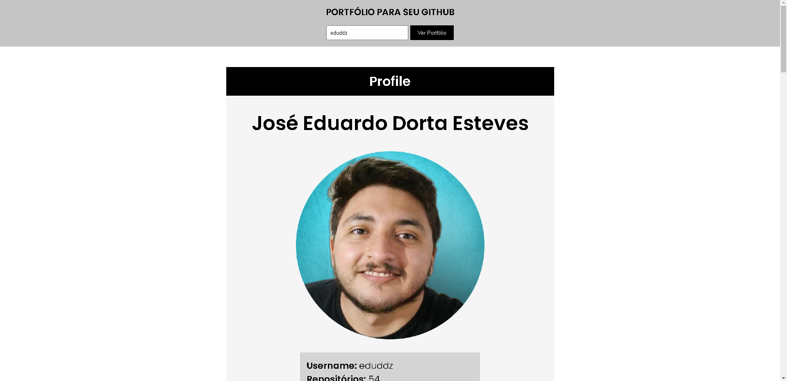
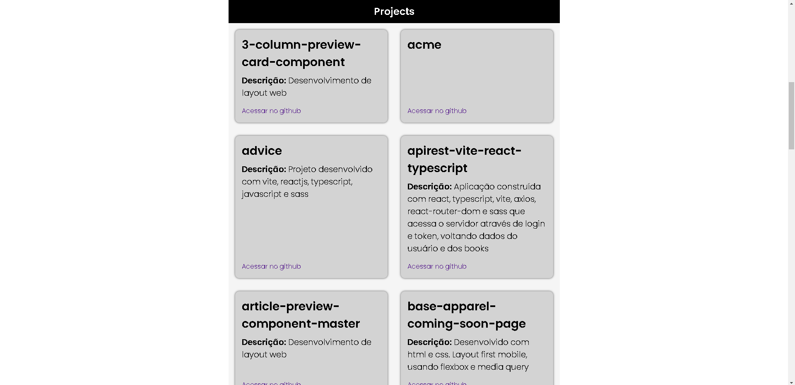
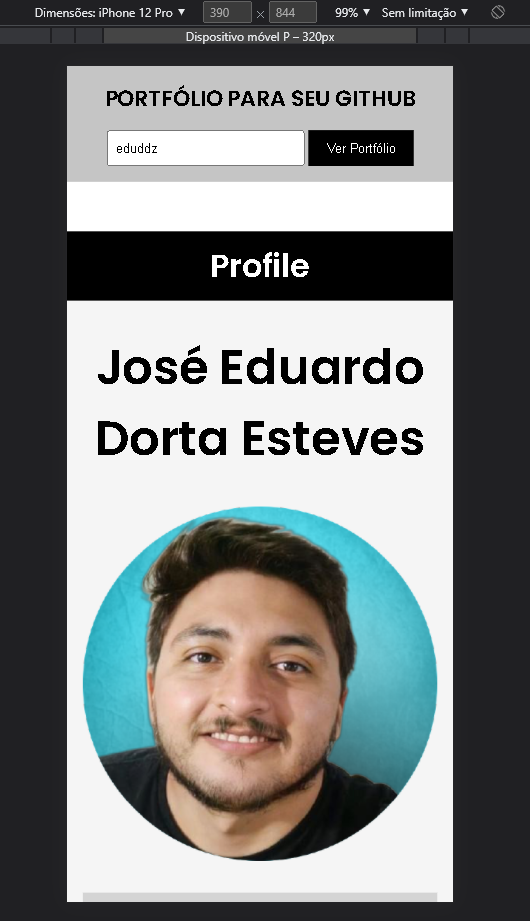
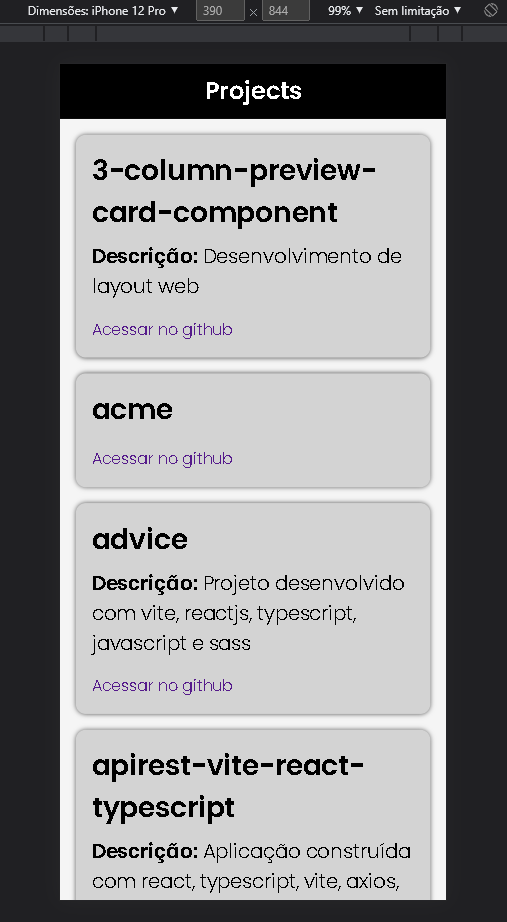

# Portfolio with Github 🏆🔥

Versão 1.0

## Code 👨‍💻

    yarn create vite portfolio --template react-ts
    |
    yarn 
    |
    yarn add axios
    |
    yarn add sass

## Layout 

Desktop 💻

Mobile 📱

